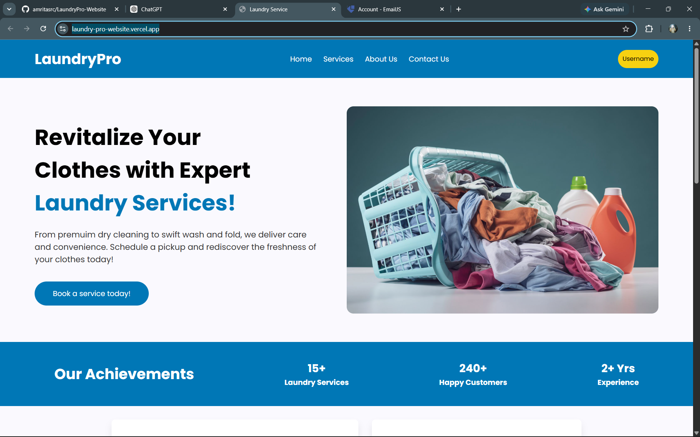
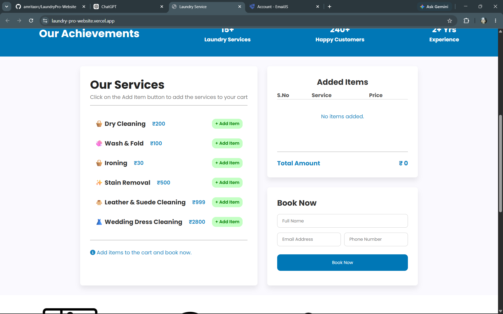
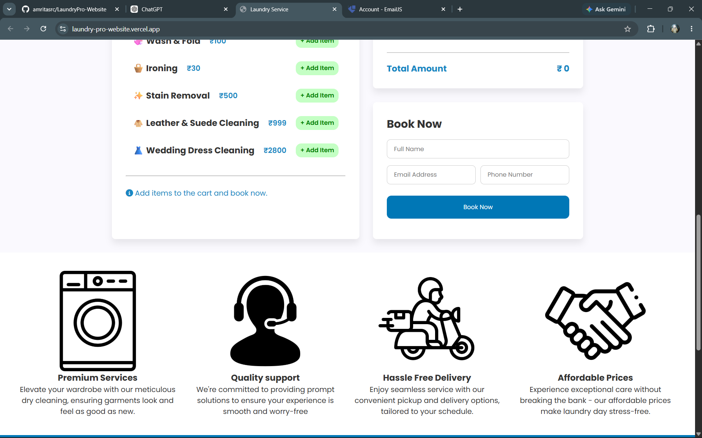
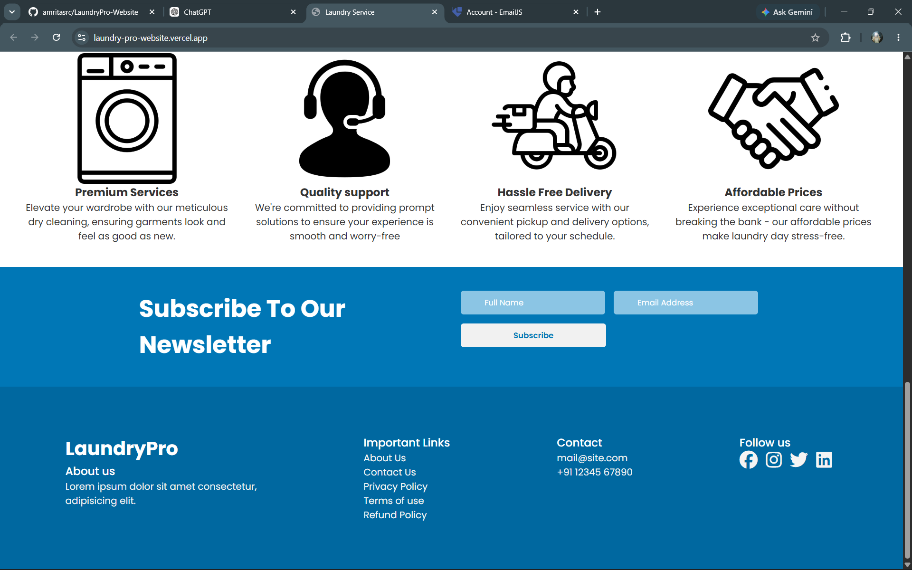

# Laundry Service Website

A simple laundry service landing page built with **HTML, CSS, and JavaScript**. This website was created to practice frontend development and experiment with **EmailJS** for sending booking details without a backend.

## Features

- Responsive design
- Service listing
- Add-to-cart functionality
- Booking form
- EmailJS integration

## 📸 Preview

|  |  |
|  |  |

## Tech Stack

- HTML
- CSS
- JavaScript
- EmailJS
- Font Awesome

## 🚀 How to Run

### 1. Clone the Repository

```bash
git clone https://github.com/your-username/laundry-service.git
cd laundry-service
```

### 2. Configure EmailJS

This project uses **EmailJS** to send booking confirmations and newsletter subscription emails.

1. Create an account at **https://www.emailjs.com/**.
2. Create an email service and connect your email provider.
3. Create the required email template(s).
4. Copy your:

   * Public Key
   * Service ID
   * Template ID(s)
5. Replace the placeholder values in `script.js` with your own EmailJS credentials.

Example:

```javascript
emailjs.init("YOUR_PUBLIC_KEY");

emailjs.send("YOUR_SERVICE_ID", "YOUR_TEMPLATE_ID", {
  // template parameters
});
```

### 3. Run the Project

Since this is a static website, open it using a local web server.

Using VS Code:

* Install the **Live Server** extension.
* Right-click `index.html`.
* Select **Open with Live Server**.


### 4. Test the Features

* Add laundry services to the cart.
* Submit the booking form.
* Subscribe using the newsletter form.
* Verify that emails are sent successfully through EmailJS.

> **Note:** The EmailJS credentials included in the project are placeholders. You must provide your own Service ID, Template ID, and Public Key for the email functionality to work.


> **Note:** This is a frontend practice website and does not include a backend or database.
